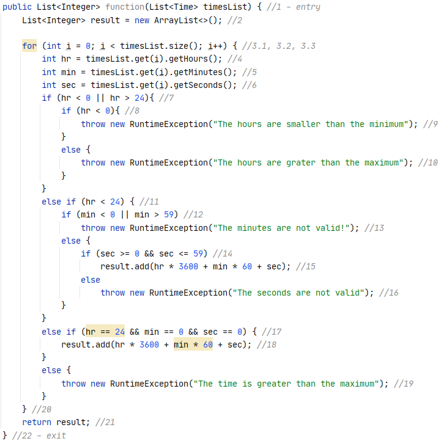
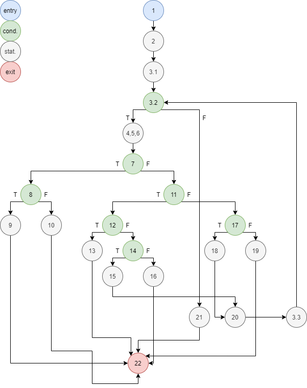
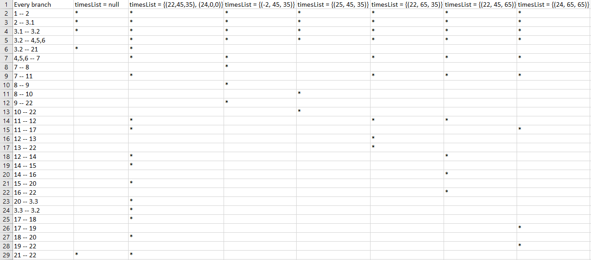

# Втора лабораториска вежба по Софтверско инженерство

## Лабина Стаменкова, бр. на индекс 193033

###  Control Flow Graph

3.1 -> i=0;  
3.2 -> i<timesList.size();  
3.3 -> i++  
Поради 5 исклучоци во кодот имаме 6 терминални ребра, заедно со реброто кое ги поврзува крајот на кодот на функцијата и излезот од кодот.

### Цикломатска комплексност
Цикломатската комплексност се пресметува на повеќе начини. Јас одбрав да ја пресметам на два начина:

- Првиот начин е со формулата CYC = E – N + 2, во која што Е е бројот на ребра,
N е бројот на јазли(темиња). Се добива CYC = E - N + 2 = 28 - 22 + 2 = 8.

- Вториот начин е со формулата CYC = P + 1, каде што P е бројот на предикатни јазли, односно јазли кои што се разгрануваат.
Така што од формулата следува: CYC = P + 1 = 7 + 1 = 8. Воочувајќи го фактот дека според две формули ја добив истата комплексност,
може со сигурност да се потврди дека комплексноста е **8**.

### Teст случаи според Multiple condtition критериум
Тест случаите според овој критериум се одбираат врз основа на тоа дали постојат if-else услови во кодот и дали if-условот е комплексен,
односно содржи повеќе услови поврзани со логички оператори (&&, ||).
Се одбираат тест случаи за секој if-услов поединечно. Во овој код имаме 4 такви if-услови:
- if (hr < 0 || hr > 24), односно темето 7  
- if (min < 0 || min > 59), односно темето 12  
- if (sec >= 0 && sec <= 59), односно темето 14  
- else if (hr == 24 && min == 0 && sec == 0), односно темето 17  

За првиот и вториот if-услов треба да се одберат случаи кои што би ги исполниле сите три можни комбинации на услови: T || X, F || T, F || F.  
За првиот if-услов ги одбрав: 
- timesList = {(-2, 45, 35)}
- timesList = {(25, 45, 35)}
- timesList = {(22, 45, 35)}  

За вториот if-услов ги одбрав: 
- timesList = {(22, -5, 35)}
- timesList = {(22, 65, 35)}
- timesList = {(22, 45, 35)}  

За третиот if-услов треба да се одберат случаи според овие три комбинации: T && T, T && F, F && X
За овој if-услов ги одбрав:
- timesList = {(22, 45, 35)}
- timesList = {(22, 45, 65)}
- timesList = {(22, 45, -5)}  

За четвртиот if-услов треба да се одберат случаи според овие четири комбинации: F && X && X, T && F && X, T && T && F, T && T && T, така што за првата комбинација нема
потреба да се одбере случај, поради тоа што ќе се задоволи со некој од погоре одбраните случаи за другите if-услови.
За овој if-услов ги одбрав:
- timesList = {(24, 45, 0)}
- timesList = {(24, 0, 45)}
- timesList = {(24, 0, 0)}  

Тестирањето врз овие случаи може да се погледне во ~/src/test/SILab2Test.java .

### Тест случаи според Every branch критериумот
Случаите според овој критериум треба да се одберат така што секое ребро треба да биде поминато барем еднаш во барем еден од случаите. Врз основа на тоа се одбира и бројот
на случаи. Јас одбрав 7 можни случаи:

Го одбрав timesList = null како еден од случаите, за да прикажам кои ребра ќе бидат поминати во случај кога работиме со празна листа. Вториот случај го одбрав за да ги изминам 
ребрата кои што доведуваат до додавање на нов елемент во листата и за да можам да ги изминам оние ребра кои што можат да се изминат само ако успешно заврши for-циклусот и
успешно се врати резултатот. Останатите случаи ги одбрав за да се изминат ребрата кои што доведуваат до фрлање на исклучоци. 
Тестирањето врз овие случаи може да се погледне во ~/src/test/SILab2Test.java .

### Објаснување на напишаните unit-tests
За тестирањето според Multiple condition критериумот, ја напишав void multipleConditionsTest() класата. Во неа напишав for-циклус, кој оди од (1,4], а во него се наоѓа еден
switch statement во кој има 4 случаи, односно секој од овие случаи тестира за секој од if-условите поединечно. За тестирањето според Еvery branch критериумот ја напишав класата
void everyBranchTest().
Во двете класи се користам со assertTrue, assertEquals, assertThrows функциите кои што се дел од JUnit. assertTrue функцијата проверува дали објектот кој е пратен како аргумент
е true, assertEquals функцијата споредува дали објектот кој е вратен од функцијата која се тестира е еднаква со друг даден објект и assertThrows проверува дали се фрла
исклучок од даден тип во функцијата која што се тестира. Ако во било која од функцииве се добие false резултат или пак во assertThrows не се детектира исклучок од дадениот тип,
тестот ќе падне и нема да се смета за поминат.

